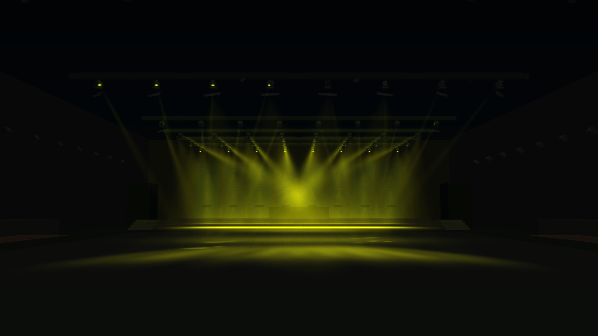
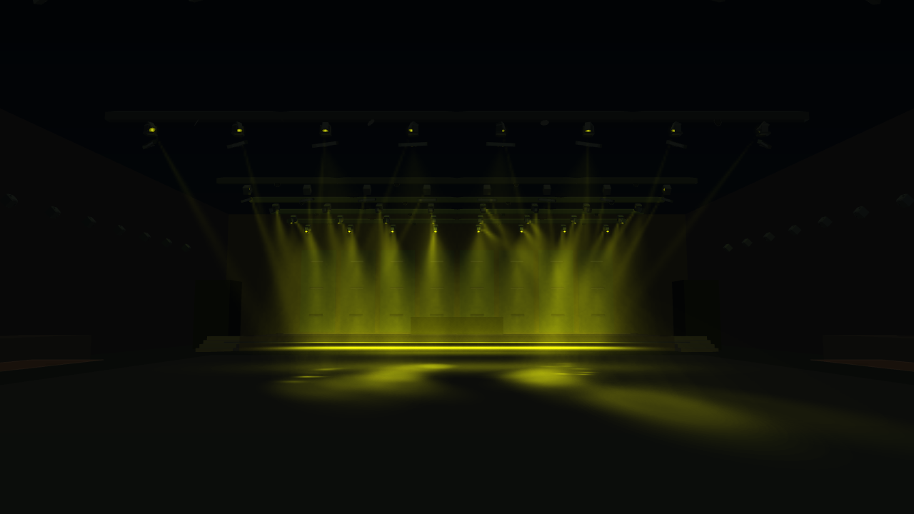

# Lies Irae: Bewegung innerhalb langer Gruppenformen

Die lokale MP3 wurde mit installierter Beat-/Stilanalyse und aktuellem Show-Worker für Automatik ausgewertet. Keine gespeicherten Nutzeredits und keine zusätzliche Stem-Analyse. Ergebnis: 215,449 Sekunden, 599 Beats, 182 Downbeats, 144 Gesten und 161 ursprüngliche Bewegungscues. Rund 193 Sekunden sind als Groove oder Impact eingestuft. Die Musik wird also nicht überwiegend als ruhig erkannt.

Die Gruppenform zwischen 38 und 56 Sekunden ist `crossed-banks`. Ihre bisherige Bewegungsphase hing allein am Fortschritt durch diese 18 Sekunden. Das erklärt, warum zusätzliche Formen allein das langsame Gesamtbild nicht behoben haben.

Die Bewegung innerhalb der Komposition erhält jetzt zusätzlich eine kontinuierliche musikalische Position aus den vorhandenen Downbeats. Energie und rhythmischer Antrieb bestimmen deren Einfluss. Es gibt keinen zusätzlichen Formwechsel-Timer; lange Formen können sich mehrfach entwickeln. Ohne Downbeats oder bei geringem Antrieb bleibt die langsame Passagenentwicklung erhalten. Bewegung=0 friert auch die musikalische Phase ein. Die auslaufende Form wird beim Übergang mit derselben musikalischen Zeit weitergeführt. „Frage und Antwort“ enthält nun auch gegenläufige Zielbewegung, nicht nur einen Helligkeitswechsel.

Offline-Vergleich bei 40–55 Sekunden: mittlerer Weg pro Ziel in normierten Flächenkoordinaten 0,655 ohne zusätzliche Rhythmusphase und 4,259 mit Rhythmusphase. Das misst den geometrischen Antrieb vor Raumabbildung und Motorbegrenzung, nicht den tatsächlich zurückgelegten Motorweg oder die wahrgenommene Qualität. Eine visuelle Abnahme der Nutzersitzung steht aus.

## Gespeicherter Bewegungsplan und Club-Bühne

Die Analyse erzeugt jetzt `songMovement`: musikalischer Grundcharakter, ausgewählte Gruppenformen sowie Tempo, Ausdehnung und Anteil der ursprünglichen Bewegung je zusammenhängender Passage. Automatik wertet diese gespeicherten Abläufe aus. Die Formenwahl findet bei neuen Plänen während der Analyse statt. Alte Pläne haben einen kompatiblen Laufzeit-Fallback; Show-Plan-Version 32 macht alte Cache-Einträge beim Laden ungültig. Es werden keine Genre-Etiketten aus Dateinamen abgeleitet. Für „Lies Irae“ ergibt sich `driving` (mittlere Szenenenergie 0,689, rhythmischer Antrieb 0,897).

Der Nutzer verwendet **Club-Bühne · Publikum & Hintergrund**, nicht Großclub. Dieses Preset hat 48 Moving Heads, davon 24 mit Wand-Zielbereich. Genau diese Bühnenköpfe waren in `applyRoomPlan` von der automatischen Gruppenbewegung ausgenommen. Die Ausnahme ist entfernt: Erst wird die Gruppenbewegung berechnet, anschließend erfolgt die vorhandene Wand-/Bodenprojektion einschließlich ihrer Grenzen und Ruhezonen. Die bestehenden Motorbegrenzungen bleiben aktiv.

### Vergleich

Lokale MP3-Analyse ohne zusätzliche Stems oder Nutzeredits, gleiche Kamera und dasselbe Analysedatenset. Der Offline-Replay läuft ab Sekunde 0 mit 30 Schritten/s; Messfenster 40–54 s. Acht virtuelle Quellköpfe werden auf die 48 Raumköpfe verteilt. Farbe und Leistung stammen gemeinsam aus dem Showframe: Das ist ein kontrollierter Bewegungsvergleich, keine vollständige Wiedergabe der gespeicherten Nutzersitzung.

| Konfiguration | Mittlerer zurückgelegter Zielweg pro Kopf |
| --- | ---: |
| Bisherige Automatik, Bühnenköpfe von Gruppenbewegung ausgenommen | 19,20 m |
| Gespeicherter Bewegungsplan und einbezogene Bühnenköpfe | 67,77 m |

Gemessen werden dreidimensionale Auftreffpunkte **nach** Raumprojektion und Motorsteuerung. Das ist kein Motor-Drehwinkel und kein Qualitätswert: Beim Übergang zwischen Boden und Wand kann sich der Auftreffpunkt weit bewegen. Die Einzelbilder belegen geänderte Ausrichtungen, nicht die wahrgenommene Flüssigkeit eines gesamten Videos. Der Vergleich im anderen Preset Großclub hatte zunächst weniger Zielweg ergeben; ein allgemeines „schneller ist besser“ lässt sich daraus nicht ableiten.

Sekunde 44, gleiche Kamera:

Reproduktion des aktuellen Zustands: `node scripts/review-song-movement.mjs prepared-plan.json output.json`. Die Audiodatei und vorbereitete Nutzerdaten sind nicht Bestandteil des Repositories. Die PNGs wurden mit dem vorhandenen WebGL-Renderer erstellt. Die Software-GPU-Messung wird nicht als Performancebenchmark verwendet.

Validierung: 823 Tests erfolgreich, darunter neue Prüfungen für gespeicherte Formen, deterministische Wiedergabe nach JSON-Roundtrip, manuelle Bewegungshalte, Flächengrenzen und Gruppenbewegung der 24 Wandköpfe.
